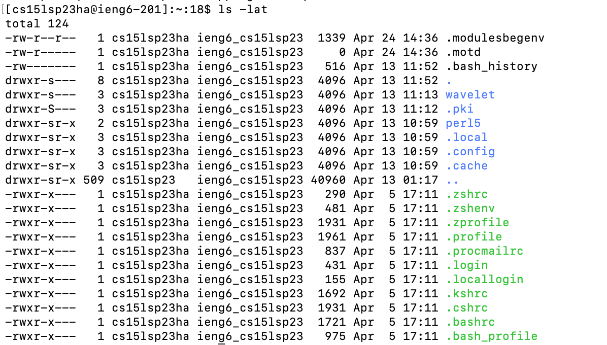
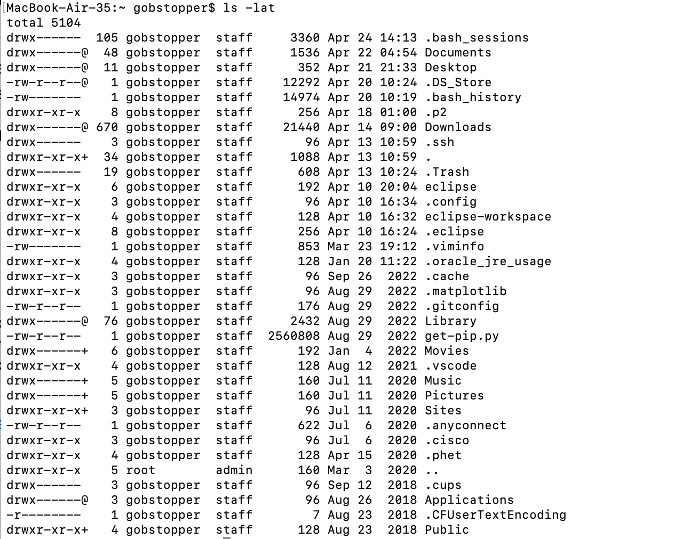

Lab Report 1 Resubmission:


The picture above represents the third step of my lab which was installing VS Code. I already had VS Code installed, but normally you would need to go to their website https://code.visualstudio.com/ and download it from there.


The picture above represents the fourth step of my lab, which was remotely connecting. Since I was using the lab computers, I installed git bash for windows. I opened up terminal on my VS Code and typed `$ ssh cs15lsp23zz@ieng6.ucsd.edu` (where zz is my own course specific username). However, I had problems with the section of the lab and was advised to use my school email and password instead.

The picture below represents the fifth and final computer oriented portion of the lab, which was trying out commands in the VS Code terminal. These commands ranged from: 
````
cd ~ 
- 
cd
ls -lat
ls -a
ls <directory> where <directory> is /home/linux/ieng6/cs15lsp23/cs15lsp23abc, where the abc is one of the other group members’ username (I used my lab partner's username which was gf)
cp /home/linux/ieng6/cs15lsp23/public/hello.txt ~/
cat /home/linux/ieng6/cs15lsp23/public/hello.txt
````

Here is `$ ssh ls -lat` result on the remote PC: 
Here is `$ ssh ls -lat` result on my personal PC: 
