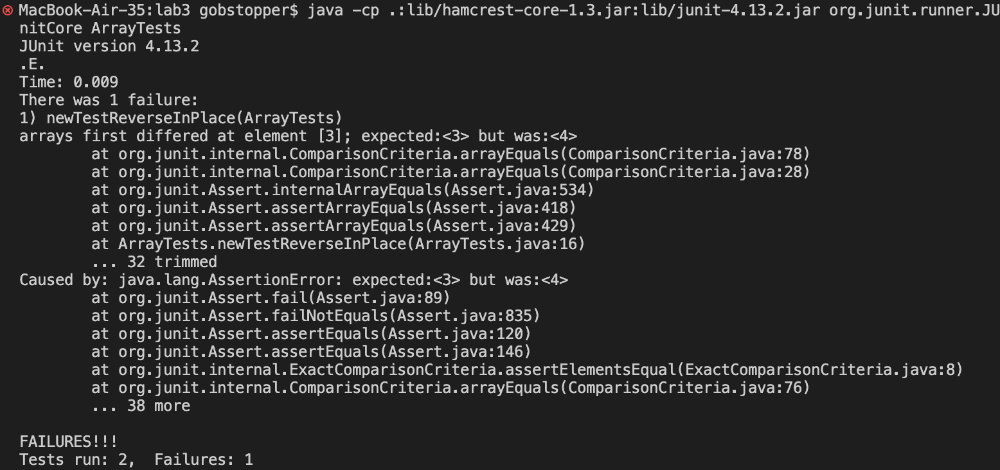

Part 1:
- 
Write a web server called StringServer that supports the path and behavior described below. It should keep track of a single string that gets added to by incoming requests. The requests should look like this: `/add-message?s=<string>`

My code for StringServer.java:
````
import java.io.IOException;
import java.net.URI;

class Handler implements URLHandler {
    // The one bit of state on the server: a number that will be manipulated by
    // various requests.
    String result = "";

    public String handleRequest(URI url) {
        if (url.getPath().contains("/add-message")) {
            String[] parameters = url.getQuery().split("=");
            if (parameters[0].equals("s")) {
                result += parameters[1] + "\n";
                return result;
            }
        }
        return "404 Not Found!";
    }
}

public class StringServer {
    public static void main(String[] args) throws IOException {
        if(args.length == 0){
            System.out.println("Missing port number! Try any number between 1024 to 49151");
            return;
        }

        int port = Integer.parseInt(args[0]);

        Server.start(port, new Handler());
    }
}
````


The handleRequest and main method are both called when making this server that adds strings. 
The main method runs after `java StringServer 4000` is called as it checks to make sure the port number 4000 is within range and available. If so, it then creates a new server using this port number with the line of code `Server.start(port, new Handler())`.
The handleRequest method runs to make sure the line `/add-message?s=` is called after the server. After detecting this line is called, it then returns the following as a string. This can be seen on the server in the picture above.


In this second picture, another message is saved, and it is added to the initial messages. This is because the values are saved to the String result and are seperated by a next line function (`\n`): `result += parameters[1] + "\n"`


Part 2:
- 

A failure-inducing input for the buggy program, as a JUnit test and any associated code:
````
  @Test
  public void newTestReverseInPlace(){
    int[] input1 = {1,2,3,4,5,6};
    ArrayExamples.reverseInPlace(input1);
    assertArrayEquals(new int[]{6,5,4,3,2,1}, input1);
  }
````

An input that doesn’t induce a failure, as a JUnit test and any associated code: 
````
  @Test 
  public void testReverseInPlace() {
    int[] input1 = { 3 };
    ArrayExamples.reverseInPlace(input1);
    assertArrayEquals(new int[]{ 3 }, input1);
  }
````

The symptom, as the output of running the tests:


The bug, as the before-and-after code change required to fix it:
Before:
````
static void reverseInPlace(int[] arr) {
    for(int i = 0; i < arr.length; i += 1) {
      arr[i] = arr[arr.length - i - 1];
    }
  }
````

After:
````
static void reverseInPlace(int[] arr) {
    int[] temp = new int[arr.length];
    for(int i = 0; i < arr.length; i += 1) {
      temp[i] = arr[i];
    }
    for(int i = 0; i < arr.length; i += 1) {
      arr[i] = temp[arr.length - i - 1];
    }
  }
````
The code needed to instantiate a temp array that will deep copy the values of the array, then make the old array equal to the new array in reverse order. It didn't work initially because the array was getting overwritten at the halfway point.


Part 3:
- 
Over these past 2 weeks I learned a lot about the navigation of my computer. I have always had diffiuculty using github and getting different files or applications to work. I think these two labs helped me learn a lot about running Junit and working with github. I also learned a lot about servers that I never knew before this class. I now know how to make server specific changes using different ports that allow interaction to play a part in the server content. I think this will come in very useful in the future, especially if I get into website design.

