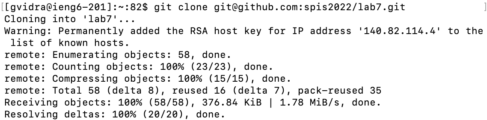
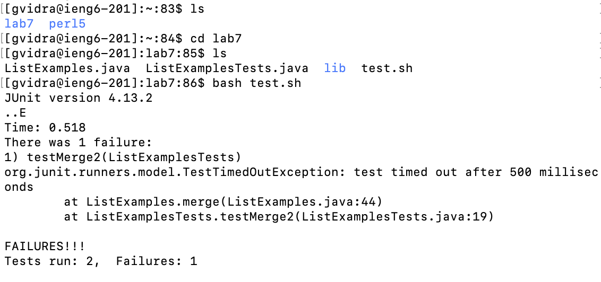
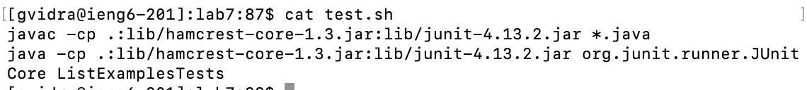
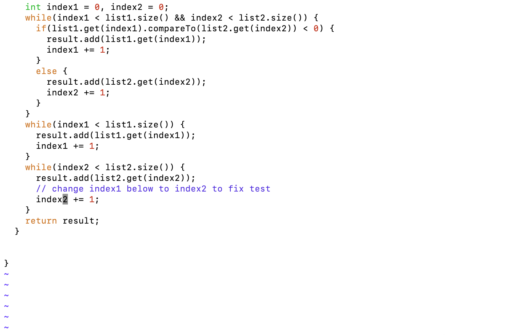
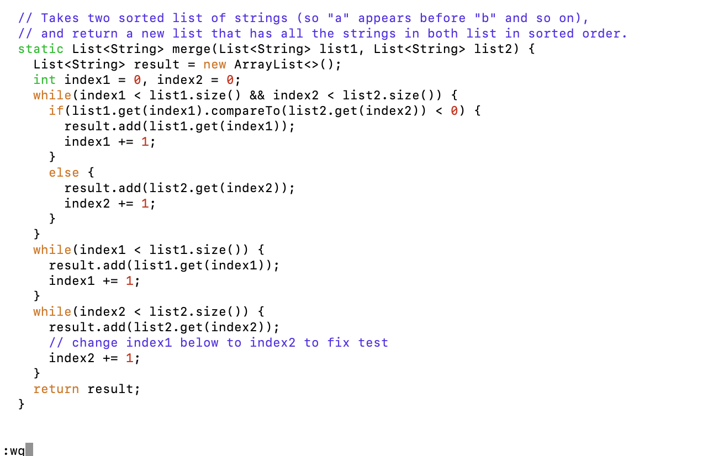
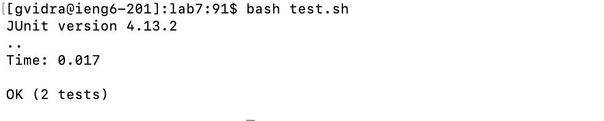
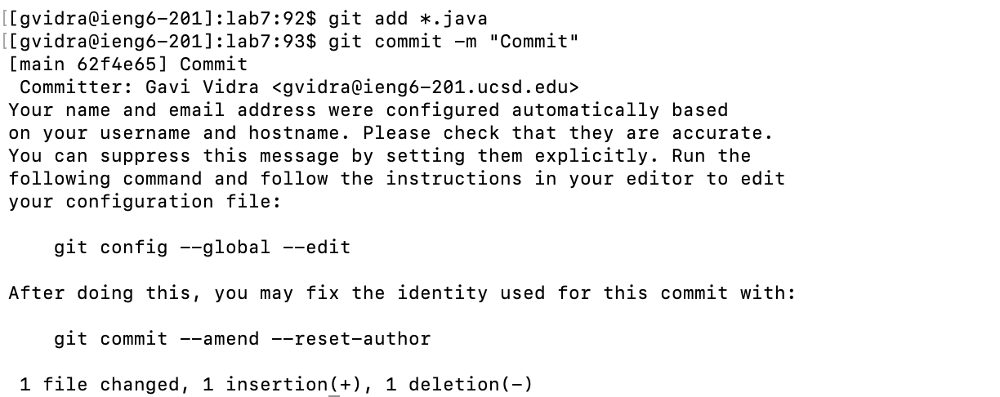
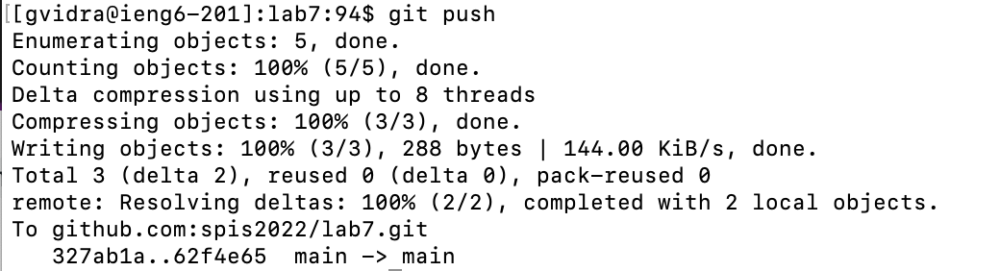
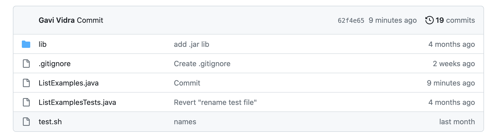

# Lab Report 4

### Log into ieng6
To do this, I must used the following ssh function which I set up in lab to enable me to log into my @ieng account without having to enter my password all the time
```
$ssh gvidra@ieng.ucsd.edu
```

The image above shows this log-in process skipping over needing to enter my password.

### Clone your fork of the repository from your Github account
```
$git clone git@github.com:spis2022/lab7.git
```

The image above uses `git@github.com:spis2022/lab7.git` as in the lab setup I gained the ability to use the ssh and https link for gitHub cloning.

### Run the tests, demonstrating that they fail
Before running the my bash function I  got a good look at the directory I was in and navigated to the directory containing the `ListExamples.java`, ListExamplesTests.java` and the `test.sh` file. The commands I do so are as follows:
```
$ls
$cd lab7 
$ls
$bash test.sh
```

As you can see in the image above, the one of the tests ran failed.

**By using the cat function, we can see that the `test.sh` file just ran the tests for us.**



### Edit the code file to fix the failing test**
From the previous part, it is aparent that in order to make our code pass the tests, we must change our code. To do this via terminal you use the `vim` command:
```
$vim ListExamples.java
```
This will open up the `ListExamples.java` file for you in your terminal.

When opening up the file, it became clear that the wrong index variable was used in one of the while loops. 
  To change it I pressed keys: `</change> <enter> <down> <right> <right> <r> <2> <enter>`

  
Once I changed the code from `index1` to `index2`, I had to leave the `ListExamples.java` file. 
  I pressed: `<:wq> <enter>`
 

### Run the tests, demonstrating that they now succeed
To do this I once again called the following `bash` code:
```
$bash test.sh
```
 
This ran the `test.sh` script again that ran the file `ListExamplesTests.java`, whose tests finally passed.

### Commit and push the resulting change to your Github account (you can pick any commit message!)
```
$git add *.java
$git commit -m "Commit"
```
 
The `git add *.java` file adds the java files, and the `git commit` changes the local files. Using `-m` I am also able to add my own message to the commit.

```
$git push
```
 
Finally, I am able to `git push` the changes made in the `git commit` to my github repository.

 
The image above shows that the push worked as `ListExamples.java` was committed very recently and reads the message I put earlier `"Commit"`.

