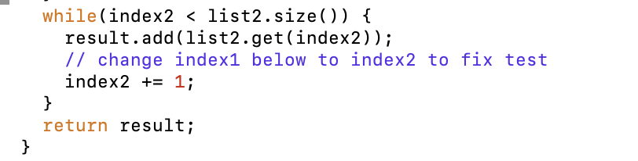

# Lab Report 4

**Log into ieng6**
```
$ssh gvidra@ieng.ucsd.edu
```


**Clone your fork of the repository from your Github account**
```
$git clone https://github.com/ucsd-cse15l-s23/lab7
```


**Run the tests, demonstrating that they fail**
```
$bash test.sh
```


**Edit the code file to fix the failing test**
```
$vim ListExamples.java
```




**Run the tests, demonstrating that they now succeed**
```
$bash test.sh
```


**Commit and push the resulting change to your Github account (you can pick any commit message!)**
```
$git add *.java
$git commit -m "Commit new changes"
```


```
$git push
```
