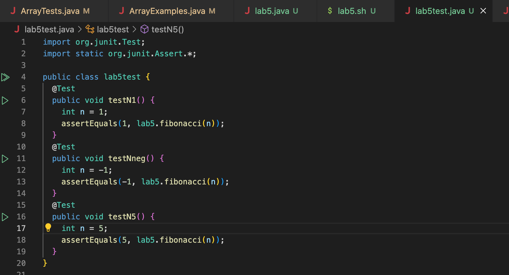

# Lab Report 5 Write-Up
## Part 1
### The following is a proper request for help
**What environment are you using (computer, operating system, web browser, terminal/editor, and so on)?**

I am using a vs code on a mac pc.

**Detail the symptom you're seeing. Be specific; include both what you're seeing and what you expected to see instead. Screenshots are great, copy-pasted terminal output is also great. Avoid saying “it doesn't work”.**

I am seeing that the expected output of the fibonacci function within my `lab5.java` file is not equal to the actual output for one of my tests. I believe that this problem is because my code is producing an output of the n+1th fibonacci number. The following is the output I recieved when running bash.


**Detail the failure-inducing input and context. That might mean any or all of the command you're running, a test case, command-line arguments, working directory, even the last few commands you ran. Do your best to provide as much context as you can.**

Looking at my code the different test cases show that my code ends up running the first 2 test cases correctly where it is asked to calculate the 1st fibonacci number and a negative number in the sequence. However, when asked to run a number n greater than 1, the fibonacci sequence seems to output a the n+1th number in the fibonacci sequence. The following is my code, test cases, and my `.sh` script used to compile my code.




### The following is a response by the TA
I would suggest that you should change the for loop initiation in the fibonacci function. Instead of starting at `int i=1` you should start at `int i=2`. This is what your code should look like:
```
for (int i==2; i <= n; i++) {
  int nextTerm = previousTerm + currentTerm;
  previousTerm = currentTerm;
  currentTerm = nextTerm;
}
```

### The following is the student's final response
Thank you so much, I have made the changes you reccommended to my code. Here is my final results:


## Part 2
### In a couple of sentences, describe something you learned from your lab experience in the second half of this quarter that you didn’t know before. It could be a technical topic we addressed specifically, something cool you found out on your own building on labs, something you learned from a tutor or classmate, and so on. It doesn’t have to be specifically related to a lab writeup, we just want to hear about cool things you learned!

In a couple of sentences, I have learned a lot about how to edit my files without going into the file. Starting with week 5, I developed the skills needed to find documents and find the number of words and characters in the document, or search for specific words in the document. Moving onto later in the quarter, I got used to using `.sh` files to create a function that would call multiple commands in terminal instead of needing to write these commands every time. Lastly, using `vim` I was actually able to edit the code in a file via my terminal. I believe that all these functions are very useful as they will help me optimize the way I write-up, edit code in the future.
